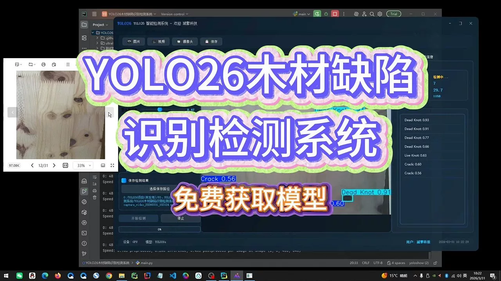
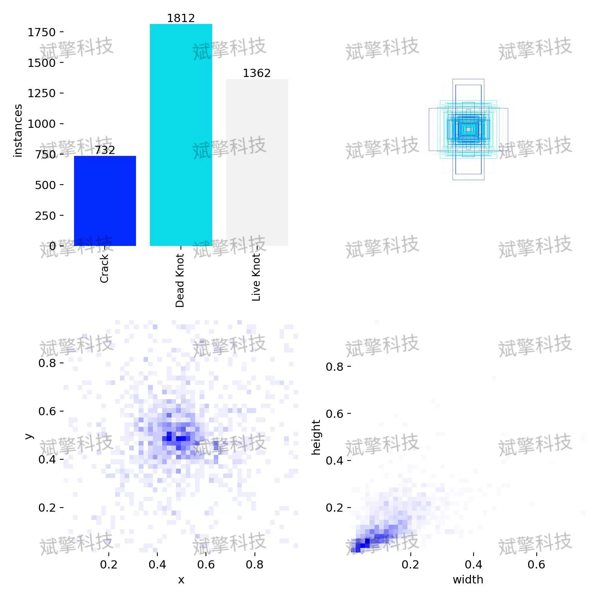
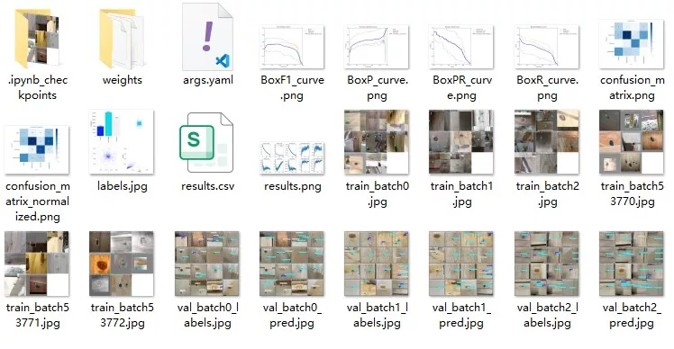
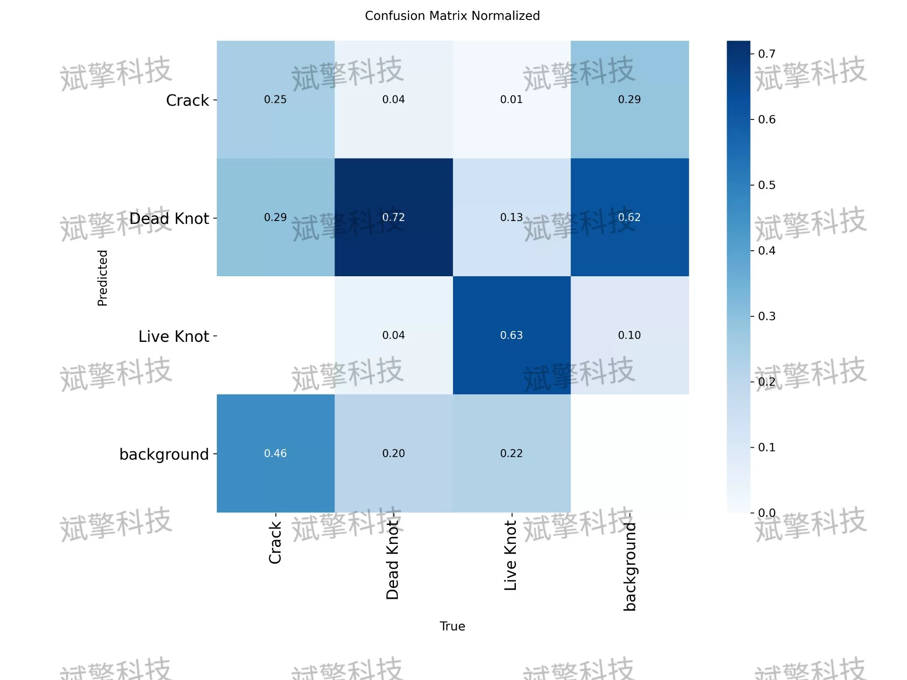
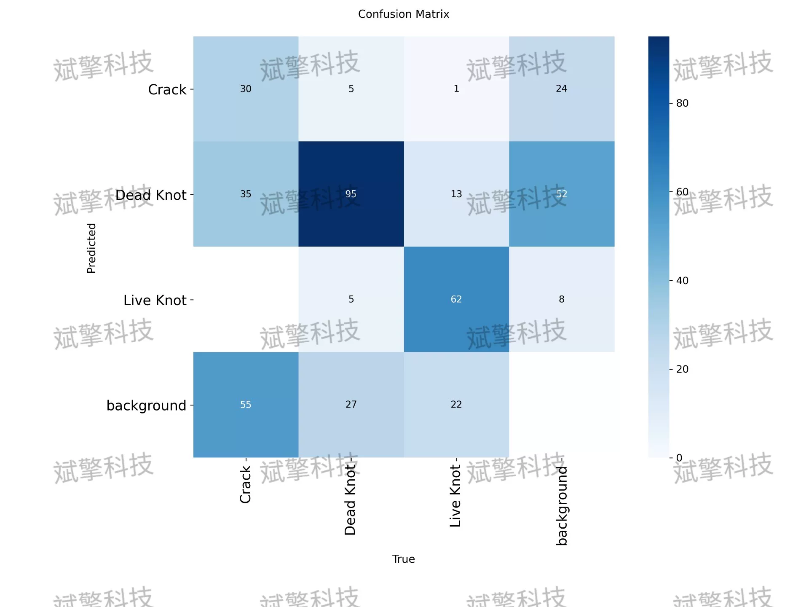
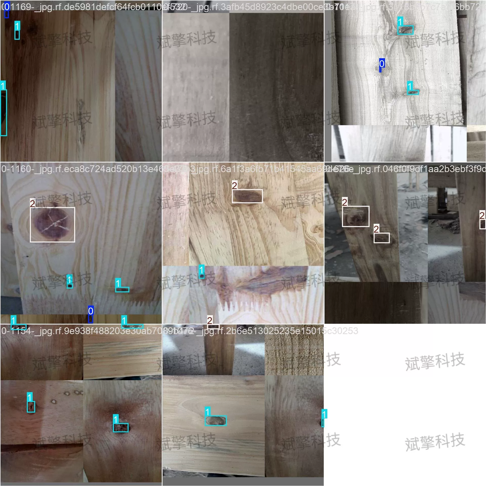
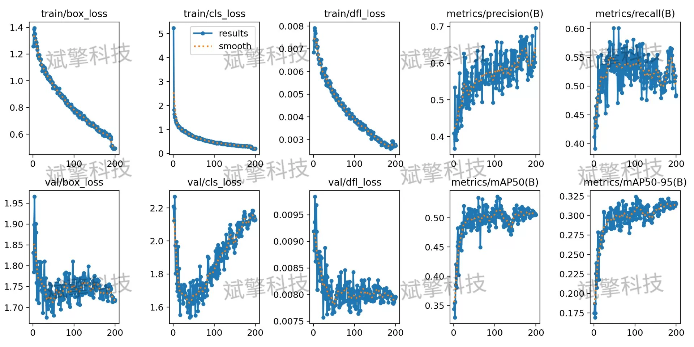
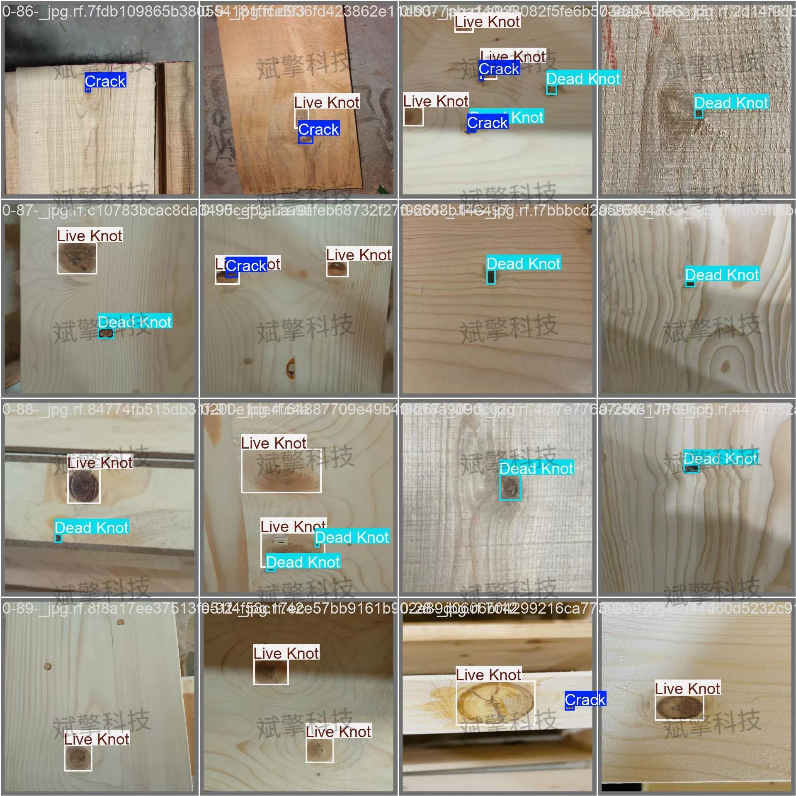
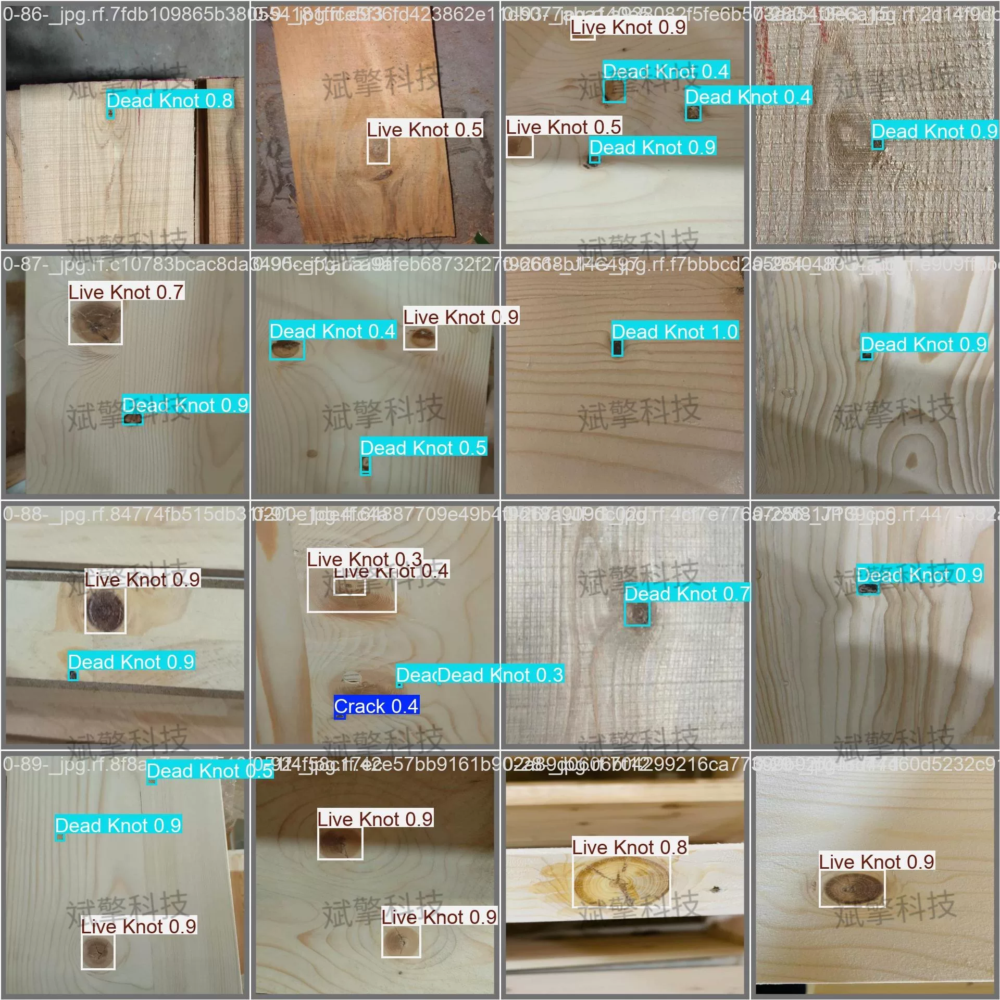

# YOLOv26 Wood Defect Detection System | Model + Source Code

## Body

YOLO26 Wood Defect Detection System | Model + Source Code YOLO26 Wood Defect Identification and Detection System (Project Source Code + Dataset + Model Weights + UI Interface + Python + Deep Learning + Remote Environment Deployment)

Automatic wood defect detection is a key process in wood processing and quality assessment. This paper builds a system for identifying and localizing three typical wood defects—crack, dead knot, and live knot—based on the YOLO26 object detection framework. The model was trained and evaluated on a dataset containing 2259 training images, 173 validation images, and 174 test images.

The dataset contains three types of wood surface defects, defined as follows:
Crack: A linear crack area along the texture direction on the wood surface
Dead Knot: A dry, loose scar that is darker in color and less compact
Live Knot: A healthy scar that is closely integrated with the surrounding wood

Training set: 2259 images
Validation set: 173 images
Test set: 174 images

Free reservation for remote installation. Unsuccessful installation will result in a full refund.
Purchase comes with the following resources (auto-unlocked in Baidu Cloud):
YOLO identification detection project complete source code
YOLO format dataset
Training code + UI interface code
Trained model + results image
Software installer
Add WeChat to make a reservation for remote installation (automatically display WeChat ID after purchase) — Unsuccessful, full refund

⚙️ Core function modules
Detection capabilities
Image detection: Upon upload, return detection boxes + category information
Video detection: Support video files, analyze each frame accurately
Camera real-time detection: Integrate USB camera for dynamic monitoring
Interaction and control
Target selection: Choose one or more categories for detection
Parameter real-time adjustment: Adjustable confidence threshold & IoU threshold, flexible control precision
Result saving: Save images/videos/camera detection results in one click
System and data
User registration and login: Support password strength check + encryption storage
Log recording: Automate operation and error information (timestamped)

## Images

## Payment

Here is a pay link on Stripe ( https://buy.stripe.com/3cs8yP7sY87d0vu9AB ). Please contact me lonlonago@foxmail.com after funding $89, and I will send you a complete data files , thank you!

